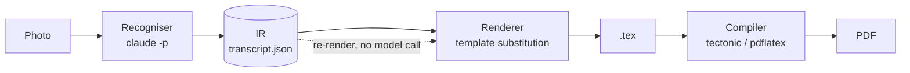

# Recognition, the IR, and the verification loop

> Written in English, like the rest of the technical content. Only UI strings and
> messages shown to the user are in French.

This document explains how a photograph of a handwritten maths lesson becomes a
`.tex` file in the teacher's own house style — and, just as importantly, which
parts of that chain can be trusted and which cannot.

---

## 1. Why there is an intermediate representation at all

Every off-the-shelf tool in this space (Mathpix, Pix2Text, GOT-OCR, the various
LLM wrappers) produces **the final document directly**: LaTeX, or Markdown with
maths. That is precisely why none of them can do what Plume needs.

Four requirements make direct output impossible:

| Requirement | Why direct LaTeX output fails |
|---|---|
| Render into *the teacher's* template | The output carries someone else's preamble; the house style is gone |
| Teacher / student variants from one scan | A "teacher-only" mark has nowhere to live in a stream of LaTeX |
| Reading rules (orange highlighter → bold, coloured bar → teacher only) | The rule's *meaning* is lost the moment it becomes formatting |
| Review comments that survive re-generation | Anchors on line numbers break as soon as anything is re-read |

So recognition never emits LaTeX for the document. It emits **typed blocks**, and
a deterministic renderer turns those into LaTeX afterwards.



The dotted arrow is the whole point. Changing template, switching audience, or
fixing a typo re-renders from the IR at **zero model cost**. Only the solid arrow
from photo to IR spends the user's subscription quota.

---

## 2. The IR

Defined in [`src-tauri/src/ir.rs`](../src-tauri/src/ir.rs).

```jsonc
{
  "version": 1,
  "pages": [{
    "number": 1,
    "blocks": [{
      "id": "p01-b04",            // assigned by Plume, never by the model
      "kind": "definition",       // one of 16 kinds
      "title": null,              // only when the page itself writes one
      "latex": "On considère deux points $A$ et $B$…",
      "confidence": 0.91,
      "doubt": "Un symbole ambigu entre « noté » et « AB ».",
      "audience": ["teacher", "student"]
    }]
  }]
}
```

**Block kinds** — `chapter`, `part`, `subpart`, `paragraph`, `text`, `list`,
`equation`, `definition`, `property`, `theorem`, `method`, `example`,
`application`, `remark`, `proof`, `figure`.

Each field earns its place:

- **`id`** is stable and assigned by Plume. Review comments anchor on it, so it
  must not depend on what the model happened to emit. *(This is also where the
  first real bug lived — see §7.)*
- **`latex`** holds body content only. No `\begin{...}` wrapper, no `\section`.
  The renderer decides how a `definition` is written, because that depends on
  the template, not on the page.
- **`confidence` / `doubt`** make uncertainty a first-class field rather than
  something to reconstruct later.
- **`audience`** is what makes one scan produce several documents.

### Why the model cannot invent the shape

The kinds list is compiled into a JSON Schema and passed to
`claude -p --json-schema`. The CLI validates the model's output against it and
retries on mismatch. There is no prose parsing anywhere in Plume.

---

## 3. How the recogniser runs

[`src-tauri/src/recognizer.rs`](../src-tauri/src/recognizer.rs) shells out to the
`claude` CLI the user already installed and signed into. Plume never talks to an
API and holds no key: recognition runs on the user's own subscription.

```
claude -p
  --model sonnet
  --output-format json
  --json-schema <compiled from BLOCK_KINDS>
  --system-prompt <replaces the default>
  --allowedTools Read
  < prompt on stdin
```

Three things about this invocation were found by measurement, not by reading
docs, and each one cost a debugging round:

1. **`--allowedTools` is variadic.** It swallows a trailing positional argument,
   so `claude -p --allowedTools Read "my prompt"` silently loses the prompt and
   fails with *"Input must be provided either through stdin or as a prompt
   argument"*. **The prompt goes through stdin.**
2. **`--json-schema` puts the validated object in `structured_output`.** The
   `result` field stays an empty string. Code that reads `result` gets nothing.
3. **The default system prompt costs ~8,300 input tokens per call**, measured on
   a trivial round-trip. For a single-shot vision task with only `Read`
   available, none of it is needed — hence `--system-prompt` (which *replaces*)
   rather than `--append-system-prompt`.

### The instruction block

The system prompt fixes the invariants: body-only `latex`, headings carry their
text in `title` with its number kept apart in `number`, diagrams become `tikzpicture` that
**redraw the mathematical object cleanly** rather than tracing the stroke, pen
colour maps to the template's semantic colours, and confidence below `0.85`
*requires* filling `doubt`.

The teacher's own conventions are appended verbatim, in their own words and
language, and are authoritative over the defaults. They arrive in four levels,
each narrowing the scope of the last:

| Level | Describes | Lives in |
|---|---|---|
| Marker rules | A visual trigger and its effect — "highlighted orange means bold" | Settings |
| Standing conventions | How this teacher works, whatever template | Settings |
| Template conventions | What this house style wants of the LaTeX | The template |
| Course rules | This one course | The course |

The template level exists because some instructions belong to the typesetting
rather than to the person: the bundled maths template asks for a continued
calculation to be grouped in an `aligned` environment, so that a line beginning
with `=` lands under the `=` above it instead of being centred on its own. Move
a course to another template and that instruction moves with it.

### Concurrency

Pages are independent and read three at a time (`CONCURRENT_PAGES`). The cap is
deliberately low: the subscription works in rolling windows, and a wide burst
buys little on a handful of pages while making quota exhaustion much easier.

---

## 4. The verification loop — and what it is actually worth

This is the part most likely to be over-trusted, so it is documented with the
numbers behind it.

A self-verifying loop was measured before being designed in: the agent writes
TikZ, compiles it, renders a PNG, **looks at its own render**, compares it to the
source crop, and iterates — capped at 3 cycles.

Three schemas from a real lesson, Sonnet, one-shot versus loop:

| Schema | Mode | Compiles | Wall time | Turns | Cost | Result |
|---|---|---|---|---|---|---|
| simple arrow | one-shot | yes | 16 s | 3 | $0.05 | correct |
| simple arrow | loop | yes | 39 s | 8 | $0.13 | correct, unchanged |
| parallelogram | one-shot | yes | 29 s | 3 | $0.06 | correct |
| parallelogram | loop | yes | 64 s | 9 | $0.16 | correct, cosmetic diff |
| axes + projections | one-shot | yes | **414 s** | 6 | **$0.54** | **wrong** — vector drawn to `(4,0)` |
| axes + projections | loop | yes | 173 s | 9 | $0.27 | **wrong** — vector drawn to `(4,1)` |

Two findings, both counter-intuitive:

**Tools make the model cheaper and faster, not slower.** On the hard schema the
one-shot run — with no tools at all — spent **414 seconds and 25,470 output
tokens** ruminating, while the loop finished in 173 s for half the cost. Given a
compiler, the model acts instead of deliberating.

**Self-verification does not catch semantic error — it certifies it.** On the
only schema it got wrong, the loop rendered its own output, looked at it, and
concluded:

> *"The render matches the original schema well. […] 1 cycle effectué.
> Corrections apportées : aucune."*

The green vector pointed **up** where the photo shows it pointing **down**. The
model was confidently wrong and its own review agreed with it.

### What this means for the design

- The loop is a **compilation guardrail**, not a correctness judge. It catches
  broken LaTeX and absurd layout. It does not catch "is this the right
  coordinate".
- **Self-reported `doubt` is necessary but not sufficient.** On the one block it
  got wrong, the model reported *no doubt at all*.
- Therefore **human review is the only real gate**, and the review UI must place
  the source photo crop directly against the rendered block. That side-by-side
  is what makes the error obvious in two seconds; nothing upstream will.

The iteration cap is enforced by the harness, not requested in the prompt. The
414-second run is the evidence: the model does not reliably stop itself.

> **Status:** the loop was validated as a spike and is not yet wired into the
> app. Recognition currently runs one shot per page. It will be introduced as a
> *fallback* — triggered on compile failure or on a block the teacher flags —
> not as the default, because on simple and medium schemas it changes nothing
> for roughly 2.5× the cost.

---

## 5. Rendering

[`src-tauri/src/render.rs`](../src-tauri/src/render.rs) walks the IR and writes
LaTeX through the document's template.

A template ([`templates.rs`](../src-tauri/src/templates.rs)) is the teacher's own
preamble with every adjustable value replaced by a `{{key}}` marker, plus a table
mapping each block kind to its LaTeX form:

```jsonc
"definition": { "mode": "environment", "name": "definition" },
"part":       { "mode": "command",     "name": "section" },
"figure":     { "mode": "centered",    "name": "" },
"text":       { "mode": "raw",         "name": "" }
```

Rendering is **substitution, never generation**. The LaTeX skeleton stays
literally the teacher's own file, so what compiles today keeps compiling.

Two guards live here, both added after seeing real output:

- **Headings use `title`, not `latex`.** The model tends to return
  `title: "Vecteurs du plan"` *and* `latex: "I - Vecteurs du plan"`. Rendering
  the latter produces `I – I - Vecteurs du plan`, because the template already
  numbers headings.
- **A title echoing the environment's own name is dropped.** The model
  occasionally returns `title: "Exemple"` on an `example` block, rendering as
  *"Exemple (Exemple)"*. The template knows each environment's label, so the
  echo can be detected and discarded.

### Audience filtering

`render_document(..., audience)` keeps a block when the audience is `all`, when
the block lists no audience, or when it lists the requested one.

Filtering happens **in the renderer, not in LaTeX conditionals**. A `.tex` handed
to a class must not carry the answers in a `\iffalse` branch or a comment.

---

## 6. Compilation

[`latex.rs`](../src-tauri/src/latex.rs) prefers `tectonic` when present (single
binary, fetches its own packages — the plan is to ship it so non-technical users
need no TeX install), and falls back to `pdflatex` / `xelatex` / `lualatex`. Two
passes for the classic engines, one for Tectonic.

On failure it extracts the first `!` line from the log rather than surfacing the
whole log, which is unreadable for the target user.

---

## 7. What has actually been measured

Page 1 of a real lesson, Sonnet, single shot:

- **7 blocks**, correctly typed: chapter, part, subpart, 2 × definition, example,
  remark — matching the page exactly
- **$0.112**, **62 s**, 9 turns
- one genuine `doubt` raised on an ambiguous symbol
- the rendered `.tex` compiled with **0 LaTeX errors**

Denser pages have been observed at roughly 150 s each, which is why the per-page
**turn count** is logged: many turns points at `--effort`, few long turns points
elsewhere.

### The bug worth remembering

`ir::Block` declared `id: String` with no serde default, while the schema sent to
the model deliberately omits `id`. Every block therefore failed to deserialise —
and a `filter_map(|raw| …ok()?)` **dropped the failures silently**. The run
reported *"0 blocks"* after spending real quota.

The fix was two lines. The lesson was not:

- parse failures are now **raised**, never skipped;
- a page yielding zero blocks is an **error**, not an empty result;
- the regression is covered by tests that parse a **real captured
  `structured_output`** against the actual Rust struct — the earlier test passed
  only because it parsed the payload in Python, testing the model instead of the
  code.

---

## 8. Review and correction

Recognition is not the last word, by design (§4). Every block is reviewable:

- **Direct edit** — kind, title, LaTeX body and audience are editable by hand.
  Nothing calls the model; the teacher's hand always wins.
- **Annotate and re-run** — a block can carry a `note`: the teacher's instruction
  in their own words. `apply_corrections` re-runs every annotated block.

A correction is **targeted**. Each page stores the `session_id` of the run that
read it, so a correction resumes that exact conversation with `--resume`: the
image and the instruction block are already in context, and only the one block
is regenerated. Without a session (transcripts produced before this existed) it
falls back to re-reading the page image — still correct, just not cheap.

Identity never comes from the model: after a correction, `id` is restored,
`note` is cleared and `reviewed` is set by Plume.

A partial failure still saves. Corrections that landed are not thrown away
because a later one broke.

## 9. Audience, figures and preview

**Audience.** Each block carries `audience`, defaulting to both. The recogniser
may restrict a block to `["teacher"]` only when the teacher's own reading
conventions describe a marker meaning "my copy only" *and* that marker is on the
block — never on its own judgement of what looks like an answer. Teacher-only
blocks are marked in the review preview, and the export step shows how many
blocks each version keeps and drops before anything is compiled.

The detection is still the model's, not deterministic colour analysis. Until the
HSV pre-pass exists, treat the tagging as a proposal the teacher confirms — the
same rule as §4: a business decision must not rest on a hallucination.

**Figures.** A diagram is where a wrong transcription hides best, so the review
preview compiles each `tikzpicture` on its own with the real engine
([`figures.rs`](../src-tauri/src/figures.rs)): a `standalone` document carrying
the course's own colour definitions, then `pdftocairo -svg`, with `pdftoppm`
as the raster fallback. Output is cached beside the course, keyed by a hash of
the TikZ source, so an unchanged figure costs nothing and an edited one is
rebuilt.

**Preview.** The export step embeds the compiled PDF in the window rather than
handing it to an external reader.

## 10. Not built yet

- **Deterministic colour detection** for reading rules (HSV pre-pass).
- **The verification loop**, as a fallback (see §4).
- **Incremental preview**: the PDF is compiled on demand, not on every edit.
